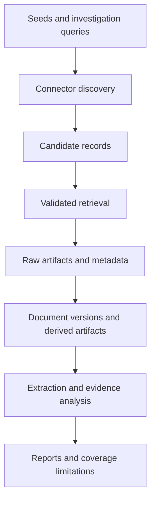
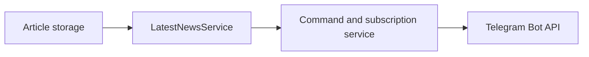

# Acquisition and Provenance Data Flow

## Status

Accepted as the architectural basis for acquisition development after the
normalized Source model.

## Purpose

Argus must acquire evidence from more than a manually maintained collection of
news feeds.

The platform should support current and historical media, scientific
publications, official records, legislation, archives, statistical datasets,
financial reports, technical documents, and other attributable information
artifacts.

The system cannot guarantee complete coverage of all available information.
It must instead make acquisition scope, failures, restrictions, and coverage
limitations visible and reproducible.

## Core principles

1. Discovery and trust assessment are separate operations.
2. A discovered source is not automatically accepted as reliable.
3. Original artifacts are preserved before normalization.
4. Derived text never replaces its original artifact.
5. Every retrieval is recorded.
6. Document versions remain distinguishable.
7. Connectors implement protocols, not individual analytical assumptions.
8. Missing evidence is not evidence of absence.
9. Access restrictions and licenses are part of provenance.
10. Acquisition results must be reproducible where external systems permit it.

## Acquisition modes

### Continuous monitoring

Continuous monitoring follows configured seeds and previously discovered
endpoints.

Examples include:

- RSS and Atom feeds;
- official publication APIs;
- legislative updates;
- statistical releases;
- scientific metadata updates;
- corporate filings;
- corrections and retractions.

### Investigation-driven discovery

Investigation-driven discovery starts from an analytical question.

It may:

- search catalogs;
- follow citations;
- discover referenced datasets;
- locate primary documents;
- retrieve historical versions;
- search for contradicting evidence;
- expand through entities and related events.

Every investigation must record the catalogs, endpoints, queries, languages,
time ranges, filters, and stopping conditions used.

## High-level flow



## Acquisition entities

### Source

A person, organization, institution, publisher, or system responsible for
making information available.

Source metadata provides context and must not be treated as a truth score.

### Collection endpoint

A technical location or interface used to discover or retrieve information.

Examples include:

- RSS or Atom feed;
- REST API;
- OAI-PMH repository;
- IIIF manifest;
- SDMX service;
- SPARQL endpoint;
- sitemap;
- web archive;
- dataset catalog.

One source may expose many endpoints. An endpoint may also aggregate records
from many sources.

### Candidate record

A lightweight discovery result that has not yet been fully retrieved or
accepted.

It may contain an external identifier, title, location, source hint, media
type, date, language, and discovery provenance.

The initial persisted `AcquisitionCandidate` is an immutable snapshot of
normalized discovery metadata. Its deterministic fingerprint excludes the
poll time: an identical rediscovery updates first-seen, last-seen and count
fields, while a changed title, location, date, language or connector version
creates a distinct snapshot. A candidate may reference a legacy `Article`,
but the reference is optional because many supported artifact types are not
news articles.

### Retrieval record

A record of one acquisition attempt.

It should contain:

- endpoint;
- connector and connector version;
- request time;
- request parameters;
- response status;
- resolved location;
- redirect information;
- content type;
- response hash;
- access and license metadata;
- errors and warnings.

The initial persisted `RetrievalAttempt` model records normalized connector,
candidate and response metadata. It may reference a legacy `Article` during
the incremental transition, but this reference is optional because not every
retrieved artifact is a news article.

New retrieval attempts may also reference the exact persisted acquisition
candidate. Candidate fields remain copied into the attempt as an immutable
audit snapshot and for compatibility with attempts recorded before candidate
persistence was introduced.

Retrieved bytes are deliberately excluded from this table. A successful
attempt records their SHA-256 hash; the unchanged bytes will be owned by the
separate raw-artifact layer. Multiple attempts for the same location are
preserved rather than updated in place.

### Raw artifact

The unchanged bytes received by Argus.

Examples include HTML, PDF, XML, JSON, CSV, images, audio, and video.

Raw artifacts receive a content hash and must not be silently rewritten.

The initial local artifact store uses SHA-256 content-addressed filesystem
paths. Repeated storage of identical bytes is idempotent, and every read
verifies the bytes against the address. SQL storage records only portable
backend and storage-key metadata, never an installation-specific absolute
path. Alternative object-storage backends may implement the same contract.

`RawArtifact` stores the digest algorithm, digest, byte size and portable
storage location. The digest and storage location are independently unique.
A successful `RetrievalAttempt` must reference a matching raw artifact;
failed, unavailable or restricted attempts must not reference artifact bytes.

The initial `RetrievalService` is the application boundary joining these
components. It reconstructs the normalized contract from one persisted
candidate snapshot, invokes the matching connector, stores successful response
bytes through the raw-artifact store, registers their portable metadata and
records every normalized retrieval outcome. It never commits implicitly;
database transaction ownership remains with its caller. Because filesystem
artifacts are immutable and content-addressed, a database rollback after a
successful file write may leave an unreferenced artifact that is safe to reuse
or garbage-collect later.

### Document

A logical attributable information object, such as an article, report, law,
speech, scientific work, or historical record.

The initial `Document` model separates this logical identity from both a
discovery candidate and any particular set of retrieved bytes. Its stable
identity is the pair `identifier_scheme` and `identifier_value`, allowing
identifiers such as a URI, DOI, legislation identifier or an Argus-owned
identifier without assuming that every document is a news article. Source,
type, preferred title and language are document-level metadata. Existing
`Article` rows remain unchanged during the incremental transition.

### Document version

A specific state of a document at a particular time.

A new retrieval with different content does not silently overwrite the
previous version.

The initial `DocumentVersion` links one document to one immutable
`RawArtifact`. A repeated registration of the same artifact is idempotent;
different bytes receive increasing version numbers within that document.
Media type and publication time describe the exact version and are checked
for conflicts when an existing version is encountered.

The initial `DocumentIngestionService` owns the next application boundary. It
accepts one successful persisted retrieval and its exact acquisition candidate,
creates or reuses the logical document, registers the immutable version and
links the retrieval attempt to that version in one caller-owned transaction.
External candidate identifiers use a connector-qualified identity scheme;
candidates without one fall back to their URI. The endpoint supplies the
document source, while the retrieved response supplies the preferred media
type. Failed retrievals and inconsistent provenance are rejected before a
document version is created. The repository layer itself still does not guess
document identity.

Legacy RSS `Article` rows are linked one-to-one to their logical `Document`
through a nullable transition key. The migration backfills existing articles
with URI-identified documents, and ongoing legacy collection creates the same
link immediately. When a persisted candidate references a legacy article,
document ingestion reuses that URI identity instead of creating a second
connector-qualified document. The key remains nullable only for compatibility
with databases and code paths that have not yet crossed this migration.

### Derived artifact

A product created from a raw artifact.

Examples include:

- extracted text;
- OCR output;
- transcription;
- translation;
- normalized metadata;
- parsed table;
- converted document format.

Every derived artifact must identify its input, method, method version,
creation time, and quality limitations.

The first application-layer derivation reads the immutable bytes referenced by
a `DocumentVersion` and records normalized main text as an `EXTRACTED_TEXT`
artifact. Extraction operates on stored bytes rather than fetching the source
again, so the result remains tied to the exact acquired representation. The
extractor is a replaceable contract; the initial HTML implementation uses
Trafilatura and records its installed version plus the heuristic limitation.
The caller retains transaction ownership.

During the incremental transition, extracted text may be projected into the
legacy `Article.content` field so the existing analysis pipeline can consume
it. The article records the exact `DerivedArtifact` supplying that text.
Projection is idempotent, requires the artifact and article to represent the
same logical document, and refuses to overwrite legacy content whose
derivation is unknown. The projection service does not commit implicitly.

The initial retrieved-document processing service composes document ingestion,
stored-byte text extraction and the optional legacy article projection into
one caller-owned transaction. It accepts an already recorded successful
retrieval, never performs another network request and returns the exact
document version, extracted-text artifact and projected article. Non-article
documents stop after extraction. Repeating the same processing request reuses
the immutable document version and derived artifact.

The initial acquisition pipeline service closes the application-layer path
from one persisted candidate to normalized outputs. It composes retrieval with
retrieved-document processing, records every connector outcome, and continues
to document ingestion and extraction only after a successful retrieval.
Unsuccessful, unavailable and access-restricted attempts remain first-class
provenance records without producing document versions or derived artifacts.
The pipeline does not commit implicitly; batch execution and per-candidate
failure isolation remain responsibilities of a later runner.

The initial batch runner supplies that transaction boundary. Each batch item
contains stable endpoint and candidate identifiers plus the connector and
document type needed by the acquisition pipeline. The runner opens a fresh
database session for every item, commits its completed retrieval or normalized
outputs independently, rolls back an exception without stopping later items,
and returns detached identifiers and aggregate counts rather than expired ORM
objects. A failed database transaction can leave content-addressed bytes that
are no longer referenced; those immutable bytes are safe to reuse and may be
garbage-collected separately.

The first operational entrypoint exposes that runner as the bounded
`argus acquire` command. It selects persisted article candidates from active
RSS endpoints in stable discovery order, constructs connectors from the
configured endpoint identity, and writes raw bytes beneath the configured
artifact directory. By default, any previously attempted candidate is skipped;
an explicit retry mode includes candidates whose earlier attempts never
succeeded only while they remain eligible for automatic retry. Access-restricted
outcomes are terminal for automatic operation, while unavailable and failed
outcomes may be retried up to three total recorded attempts. Successful
acquisitions and candidates that reached the retry limit remain excluded.
Source-level protection also pauses a source for 24 hours when its three most
recent retrievals in that window are all access-restricted. A success,
unavailable result or technical failure breaks that consecutive series, so an
isolated timeout does not disable the source. Paused sources are reported in
the runtime log, and their candidates do not consume the acquisition batch
limit. The command reports processed, retrieval-only and failed counts without
changing the legacy collection or parsing commands during the migration.
The read-only `argus acquisition-status` command summarizes active RSS
candidates into mutually exclusive unattempted, succeeded, retryable,
access-restricted and retry-exhausted states. It also reports sources currently
paused by the source-level protection, allowing operators to inspect the queue
without performing network retrieval or changing acquisition state.

Legacy RSS discovery also distinguishes endpoint access restrictions from
temporary technical failures. An HTTP 401 or 403 deactivates the persisted
collection endpoint and is reported without a traceback; subsequent collection
cycles skip that endpoint without another network request. Timeouts, transport
errors and server failures remain retryable and do not change endpoint
activation. Reactivating an endpoint is an explicit operator decision, so a
persistently restricted feed cannot silently consume every operational cycle.

The initial `DerivedArtifact` model records one immutable JSON result against
the exact `DocumentVersion` used as input. Artifact type, method, method
version and result-schema version make the transformation reproducible; a
SHA-256 digest of canonical JSON makes repeated registration idempotent.
Quality limitations are stored with the result and conflicting limitations
are rejected rather than silently replacing provenance. Transaction ownership
remains with the caller. This storage layer does not yet run extraction or
replace the legacy parsing pipeline; the first extraction service will be a
separate application-layer step.

The first Knowledge Extraction layer consumes one immutable text-derived
artifact and produces an `ENTITY_MENTIONS` artifact. Its payload records the
exact input artifact identifier and hash, document language, ordered character
spans, original model labels and normalized Argus mention types. English and
Russian recognition use separately versioned spaCy model packages. Character
offsets are validated against the exact input string before persistence.

`EntityMention` rows project those immutable spans into indexed relational
records for later claim and event extraction. They remain observations, not
resolved real-world entities: identical normalized text is not merged, and no
knowledge-base identity is assigned. The recognition service does not commit.

The bounded `argus extract-mentions` entrypoint supplies the transaction and
batch boundary. It selects text artifacts in stable identifier order and
processes each input in an independent transaction, so one invalid document
does not roll back later results. Inputs already recognized with the same
recognizer, model version, result schema and exact input content hash are
skipped without consuming the batch limit. A newly installed model version
therefore creates a new immutable result instead of silently treating an older
run as current. Texts without a supported explicit language remain outside
this recognizer's queue. The command reports processed inputs, failures and
the total number of projected mentions; it does not resolve aliases or assign
entity identity.

The read-only `argus mention-audit` entrypoint summarizes the persisted
projection before any alias or identity resolution is attempted. It reports
mention counts by language and normalized type, the most frequent normalized
forms, the densest reproducible recognition artifacts and a deterministic
type-balanced sample with exact offsets. Frequent strings remain grouped by
mention type and are explicitly reported as forms rather than canonical
entities. Recognition artifacts are counted separately from document versions
so results from multiple model versions cannot be silently combined. The
command performs no recognition and does not modify database state.

The next Knowledge Extraction foundation consumes one immutable
`ENTITY_MENTIONS` artifact and produces a separately versioned
`ENTITY_CANDIDATES` artifact. Every input mention receives an explicit decision.
Person, organization, location and other potentially identifiable object types
become queryable `EntityCandidate` rows. Numeric, quantitative and temporal
expressions remain immutable raw mentions and are recorded as excluded
decisions rather than silently discarded.

Candidate canonicalization is deliberately conservative: it normalizes Unicode,
whitespace and case, but does not merge equal strings, expand abbreviations,
lemmatize names, repair the upstream NER type or assign a knowledge-base
identity. Accepted candidates retain a bounded, exact source-text context with
absolute character offsets. The candidate artifact records the exact parent
artifact identifier and hash plus both the upstream recognition version and the
canonicalization version. Re-running a changed canonicalizer therefore creates
a new result without replacing previous decisions. The service does not commit;
batch selection and CLI execution remain an application-layer concern.

The bounded `argus generate-candidates` entrypoint supplies that transaction and
batch boundary. It selects `ENTITY_MENTIONS` artifacts in stable identifier
order and processes every input in its own transaction, so invalid provenance
or offsets in one NER result do not roll back later results. An input already
processed with the same canonicalization method, method version, result schema
and exact content hash is skipped without consuming the limit. A new
canonicalizer version therefore requeues the same immutable NER input and
stores its decisions alongside the earlier result. The command reports
processed inputs, failures, accepted candidates and explicitly excluded
decisions. It does not alter raw mentions, repair NER labels, merge aliases or
assign real-world identity, and it is not part of the general operational
`run` command.

The read-only `argus candidate-audit` entrypoint evaluates the persisted
candidate projection before any alias resolution is implemented. It reports
candidate counts by language and type, frequent canonical forms, dense
candidate artifacts and a deterministic type-balanced context sample.
Candidate artifacts are counted separately from document versions so outputs
from multiple canonicalizer versions remain visible rather than being silently
combined.

The audit also emits bounded, review-only alias signals for three transparent
string relationships: acronyms, full-versus-short person names and simple group
inflections. Each signal retains both forms, their frequencies, shared-document
count and source contexts. These deterministic heuristics are discovery aids,
not identity decisions: the command creates no entities, stores no aliases,
merges no candidates and does not modify database state.

The next identity-resolution foundation can persist those conservative signals
as separately versioned `ALIAS_PROPOSALS` artifacts. One proposal artifact
consumes one exact `ENTITY_CANDIDATES` artifact and records its identifier,
content hash, canonicalizer version, proposal method and proposal-method
version. Queryable `AliasProposal` rows retain both representative candidate
identifiers, both forms, the signal type, occurrence evidence, heuristic
confidence basis and rationale.

Proposal generation remains deliberately narrower than entity resolution. It
compares only forms that co-occur in the same candidate artifact, does not
repair NER types, does not infer corpus-wide equivalence, and creates neither
an `Entity` nor an approved alias. Its numeric confidence is an uncalibrated
deterministic ranking rather than an identity probability.

The bounded `argus propose-aliases` entrypoint supplies the transaction and
batch boundary. It selects `ENTITY_CANDIDATES` artifacts in stable identifier
order and processes each input in its own transaction, so one malformed
candidate result does not roll back later proposal artifacts. An exact input
identifier and content hash already processed with the same proposal method,
method version and result schema is skipped without consuming the limit. A new
proposer version therefore requeues the same immutable candidate input and
stores its review signals alongside the earlier result.

An input with no supported alias relationship still produces a valid, empty
`ALIAS_PROPOSALS` artifact and counts as processed. The command reports input
artifacts, failures and generated proposals. It is not part of the general
operational `run` command and it creates no entities, approves no aliases and
merges no candidate records.

The read-only `argus alias-proposal-audit` entrypoint exposes the stored
proposal population before any approval workflow or entity registry is
designed. It reports counts by signal, entity type and explicit heuristic-score
band, including empty proposal artifacts so the absence of a supported signal
is not hidden. Dense runs remain tied to their exact input artifact, document
version and proposer version.

Review examples include both proposed forms, their representative candidate
identifiers, occurrence counts, shared-document support, rationale,
confidence basis and both bounded source contexts. The bands are descriptive
views of the stored deterministic score (`high` at least 0.80, `medium` at
least 0.70 and `low` below 0.70); they are not approval thresholds or
probabilities of identity. The audit also surfaces the union of recorded
quality limitations and never writes review decisions, aliases or entities.

The first manual review foundation records an append-only `AliasDecision`
against one exact `AliasProposal`. Every row stores an explicit status
(`approved`, `rejected` or `needs_review`), a required reason, a reviewer and a
monotonic per-proposal revision. Later decisions point to the exact earlier
decision they supersede instead of mutating it, so the review history remains
auditable.

Decision recording is an application service with an external transaction
boundary. The foundation has no batch automation or decision thresholds:
heuristic confidence bands never become approval rules. Even an approved
decision creates no entity, persists no operational alias and merges no
candidate records.

The manual review CLI keeps queue inspection and mutation separate.
`argus alias-review-queue` is read-only and lists, in stable proposal order,
only proposals with no decision or whose latest decision is `needs_review`.
Every row includes both forms, signal metadata, occurrence support, bounded
contexts and the latest review metadata. Approved and rejected proposals leave
the open queue but remain in the append-only decision history.

`argus decide-alias` accepts exactly one explicit proposal identifier, status,
reason and reviewer. It commits that one decision in its own transaction;
failure rolls the transaction back. Re-reviewing a proposal appends the next
revision and supersedes the prior decision without mutating it. The command
has no batch mode, never derives a verdict from confidence, and still creates
no entity, operational alias or candidate merge.

The first entity registry is an explicit consumer of that review ledger.
`argus resolve-alias` accepts one proposal whose latest decision is
`approved`. When no proposal candidate has been resolved yet, the operator
must select one of the two candidates as the canonical name and a new
`Entity` is created. When one candidate is already assigned, the other may be
added to the same entity; an existing entity may also be selected explicitly.

Every candidate assignment and every registry expansion retains the exact
approval used as evidence. The operation is idempotent for that approval and
never changes the proposal or decision history. Candidates already assigned
to two different entities are not merged: the command stops because entity
merge and canonical-name revision require their own future audited workflow.
A later decision that supersedes the consumed approval remains visible in the
append-only review history and does not silently erase historical registry
rows.

The read-only `argus entity-registry-audit` command is the first conservative
validity boundary over those historical rows. It groups registry evidence by
entity and alias proposal, compares the applied decisions with the proposal's
latest review revision and assigns one explicit state:

- `active`: the latest decision is `approved` and that exact approval has been
  explicitly consumed for the same entity;
- `pending_reapplication`: the latest decision is another approval, but that
  exact revision has not yet been consumed;
- `needs_review`: the latest review suspends operational use;
- `revoked`: the latest review rejects the alias relationship.

An entity is reported as safe for downstream use only when every proposal link
recorded for it is `active`. Reapproval therefore does not silently reactivate
an old application: the operator must run `resolve-alias` again, which appends
evidence for the latest approval without rewriting assignments or earlier
evidence. Rejection and review suspension likewise remain non-destructive;
they block downstream use while preserving the complete registry history.

The `argus safe-entities` entrypoint and
`get_safe_entity_projection()` service form the first enforceable downstream
boundary over that audit rule. They expose no entity unless every proposal
link recorded for it is currently `active`. Filtering is entity-atomic: a
partly invalidated identity is omitted completely instead of returning only
the assignments whose individual evidence still appears valid.

Each returned entity is a detached immutable projection containing its
canonical identity, every assigned candidate observation and the exact latest
approval for every active proposal link. Candidate provenance retains the
document version, derived artifact, entity mention and assignment decision.
The projection is ordered by persistent entity identifier, supports a bounded
result and an optional entity-type filter, and performs no database write.

The projection reuses the same complete validity evaluator as
`entity-registry-audit`; it does not implement a second interpretation of
approval state. An entity with no reconstructable proposal links is blocked,
not accepted through vacuous truth. Downstream analytical services should
consume this projection rather than query `entities` or
`entity_candidate_assignments` directly whenever resolved identity is being
treated as settled.

The `argus document-entities` entrypoint and
`get_document_entity_projection()` service apply the same safety boundary to
one exact `DocumentVersion`. They select only candidate assignments belonging
to entities that are safe in the complete registry snapshot, then expose the
mentions actually observed in the requested version. A blocked entity is
omitted from the document atomically even when one of its individual
occurrences was assigned by an approval that remains active.

Every returned document occurrence retains the candidate, mention, derived
artifact, source label, exact character span, surface and normalized text, and
the decision that assigned the candidate. The containing entity also retains
all of its currently active proposal revisions. Occurrences from other
document versions are never included, although an active resolution elsewhere
remains visible as identity provenance.

The document projection is read-only, ordered by persistent entity identifier
and source-text span, and bounded by entity count rather than occurrence
count. It rejects an unknown document version and fails closed when candidate,
mention, artifact, document-version or entity-type provenance is inconsistent.
Analytical stages that start from a document should consume this projection
instead of joining candidate assignments directly.

The read-only `argus document-entity-coverage` command and
`get_document_entity_coverage()` service complement that positive projection.
For one exact `DocumentVersion`, every entity candidate is classified exactly
once as:

- `safe_resolved` when it is assigned to an entity that passes the complete
  registry validity boundary;
- `unassigned` when no registry assignment exists;
- `blocked` when an assignment exists but any registry link for that entity is
  no longer active;
- `invalid_provenance` when the candidate, mention, assignment and entity chain
  is structurally inconsistent.

The audit reports complete counts before applying its evidence-row limit, so a
bounded terminal view cannot be mistaken for complete coverage. An optional
entity-type filter is applied before both counts and bounding. Blocked rows
include the current registry validity states, while invalid rows include an
explicit provenance issue. This distinction prevents downstream analysis from
interpreting an empty safe projection as evidence that the document contains
no entity mentions.

The read-only `argus document-entity-readiness` command,
`get_document_entity_readiness()` service and
`require_document_entity_readiness()` guard turn those complete coverage
counts into an enforceable document-level contract. The contract has no score
or configurable completeness threshold. A document version is `ready` only
when it has at least one entity candidate and every candidate is
`safe_resolved`.

All other states fail closed:

- `no_candidates`: the coverage layer cannot establish whether the document
  legitimately contains no entities or the upstream entity path is absent;
- `incomplete`: at least one candidate remains unassigned;
- `blocked`: at least one assignment points to an entity whose registry
  validity is not fully active;
- `invalid`: at least one candidate has structurally inconsistent provenance.

When several problems coexist, the deterministic precedence is `invalid`,
`blocked`, then `incomplete`. The report retains the complete counts for every
coverage state, and `require_document_entity_readiness()` raises instead of
allowing a non-ready version into an entity-dependent analytical stage. An
optional entity-type filter creates an explicitly typed readiness contract;
it must not be confused with readiness of the complete document.

The read-only `argus corpus-entity-readiness` command and
`get_corpus_entity_readiness()` service apply the same contract to every
persisted `DocumentVersion`. The batch path evaluates registry validity once
and keeps all document coverage checks inside one database session, so one
corpus report cannot mix different registry revisions. It includes versions
with no candidates rather than silently dropping them.

Corpus totals and readiness-state counts are always complete. `--limit`
bounds only the detailed document rows, and `--status` filters only those
rows; neither option changes the totals. This allows operators to locate
ready, incomplete, blocked or invalid versions without mistaking a filtered
terminal view for corpus coverage. The optional entity-type filter is applied
before candidate classification and is carried by the report.

The read-only `argus ready-document-versions` entrypoint and
`select_ready_document_versions()` service form the downstream admission
boundary. They expose only detached document-version DTOs whose corpus report
is exactly `ready`; no unsafe status is represented in the result type.
The complete ready count remains independent of the selection limit, and an
inconsistent readiness report fails closed instead of yielding a partial
selection. A type-filtered selection is safe only for that explicit type.

The read-only `argus latest-news` entrypoint exposes the first user-facing view
over the legacy article collection. It orders articles by recorded publication
time, places missing publication times after known ones and uses fetch time and
identifier only as deterministic tie-breakers. Its default terminal rendering
is a reader-oriented feed containing local publication time, source, title,
bounded whitespace-normalized excerpt when available and the original URL.
The header reports how many shown articles have extracted content, only a feed
summary or only a headline.

Extracted text passes a language-independent readability guard before it is
stored or rendered. Binary-like output with replacement or control characters
is rejected. The parser retries such downloads while explicitly requesting
gzip or deflate encoding, and the reader suppresses previously stored damaged
content while retaining a readable feed summary when one exists.

Publication timestamps in the legacy SQLite model are stored as naive UTC.
The command therefore interprets them as UTC and converts them to the explicit
IANA timezone selected by `--timezone`; the default is UTC. `--details` adds
article identifiers, fetch time, language, parsing state and excerpt origin
without changing the underlying query or writing to the database.

The legacy `argus parse` queue remains oldest-first by default. The explicit
`--newest` option applies the same publication-time ordering as the reader
feed, allowing a bounded batch of current articles to receive extracted text
without silently changing the established backlog-processing policy.

This view is a chronological reading feed, not a claim about importance.
It performs no clustering, deduplication, scoring, summarization or database
write. Its detached service result is intentionally independent of terminal
formatting so a later web or Telegram delivery adapter can reuse the same
selection semantics without duplicating data-access logic.

## Connector boundary

A connector is responsible for protocol-specific discovery and retrieval.

Conceptually, connectors provide operations equivalent to:

```python
class Connector:
    def discover(self, request):
        ...

    def retrieve(self, candidate):
        ...

```
Connectors return normalized acquisition contracts. They do not create claims,
determine truth, classify propaganda, or produce analytical conclusions.

Initial connector families should include:

- RSS and Atom;
- scholarly metadata APIs;
- OAI-PMH repositories;
- statistical-data APIs.

Relevant open standards and catalogs include:

- Crossref REST API;
- OpenAlex API;
- OAI-PMH;
- IIIF;
- W3C DCAT;
- SDMX;
- W3C PROV-O.

## Candidate lifecycle

Acquisition candidates may move through the following states:

- discovered;
- validated;
- registered;
- scheduled;
- retrieved;
- parsed;
- rejected;
- quarantined;
- unavailable;
- access restricted;
- superseded.

Rejection and quarantine require explicit reasons.

## Evidence quality boundary

Acquisition stores provenance and measurable quality indicators. It does not
assign one permanent reliability percentage to a source.

Future evidence assessment may separately consider:

- source identity;
- artifact authenticity;
- primary or secondary status;
- directness;
- temporal proximity;
- expertise;
- methodology;
- independence;
- corroboration;
- corrections or retractions;
- conflicts of interest;
- context completeness;
- extraction, OCR, transcription, or translation quality.

Assessments must be versioned and evidence-backed.

## Coverage reporting

Every investigation should eventually report:

- connectors used;
- catalogs and endpoints queried;
- time and language coverage;
- unavailable or restricted material;
- failed retrievals;
- geographic and institutional gaps;
- stopping conditions;
- known corpus bias.

## Incremental transition

The existing RSS pipeline remains operational.

The transition will proceed as follows:

1. define protocol-independent acquisition contracts;
2. adapt RSS collection to those contracts;
3. introduce collection endpoints and retrieval records;
4. introduce raw-artifact storage;
5. define documents and document versions;
6. migrate existing articles into the document model (current);
7. add one scholarly connector;
8. add one statistical connector;
9. add archive discovery;
10. introduce evidence-quality assessments.

Existing Article processing will not be removed until the replacement path is
implemented, migrated, tested, and documented.

## Telegram reader delivery

The outbound Telegram adapter is a public multi-user reader downstream from
`LatestNewsService`:



The adapter does not rank articles, mutate analytical evidence, or own
news-selection policy. `/latest` requests the same bounded chronological
report used by the CLI reader and renders it for Telegram's HTML and
message-length constraints.

Telegram chats are registered automatically on `/start`, `/latest`,
`/subscribe`, or `/unsubscribe`. `/subscribe` and `/unsubscribe` independently
control automatic delivery. Access, subscription and cursor state are
persisted per chat in SQLite. A per-chat cooldown bounds repeated `/latest`
database reads and Telegram responses.

The persisted row is deliberately minimal: Telegram `chat_id`,
access/subscription flags, a delivery cursor, and database timestamps.
Usernames, display names, phone numbers, and command text are not persisted.
`/forgetme` deletes the row, and delivery failures are logged without the raw
`chat_id`.

Automatic collection and parsing run once per delivery cycle:

```text
subscribed chats -> RSS collection -> oldest unseen parsing slice
    -> per-chat unseen article slice -> bounded Telegram messages
    -> per-chat cursor advancement
```

Each cursor is delivery state, not analytical evidence. A new subscription is
initialized at the current ingestion boundary and therefore does not replay
history. A cursor advances only after Telegram accepts the corresponding
message. Failure for one recipient neither advances that recipient nor blocks
delivery to the remaining recipients. Manual `/latest` reads remain
independent of delivery cursors.

Runtime credentials are not stored in repository configuration. The bot token
is loaded from an environment variable. The optional administrator identifier
and legacy single-user identifier remain accepted only to preserve and import
previous delivery state.

The adapter uses synchronous long polling and requires no public inbound
server. Update offsets are held in memory and advanced for every normalized
update. Delivery is at least once: an interruption after Telegram accepts a
message but before its cursor is committed may cause that message to be
delivered again after restart.
